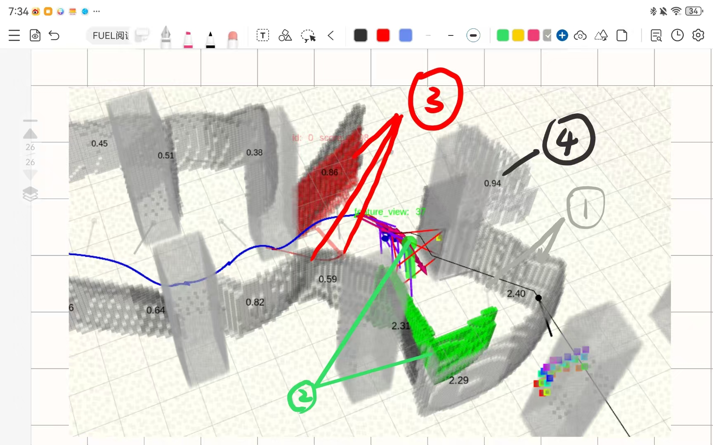
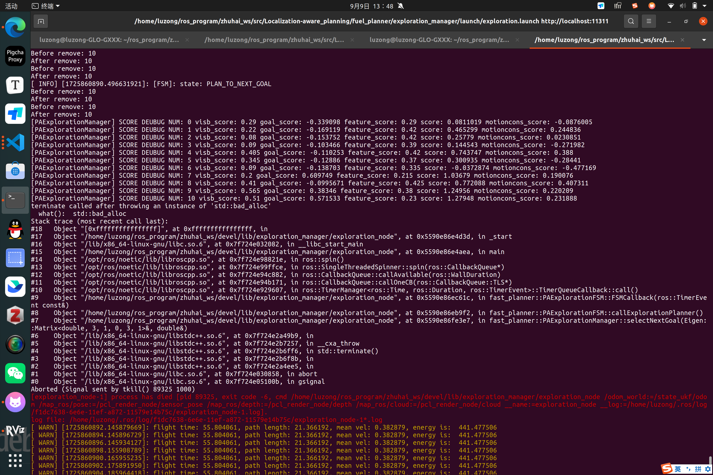

# 更新日志

## 10月5日更新

### 步进调试

- **逻辑说明**

  ```xml
      <param name="debug/start_debug_mode" value="true" type="bool" />
    <!-- input 'enter' to step debug if debug_delay_time < 0 -->
    <param name="debug/debug_delay_time" value="0.2" type="double" />

    <param name="debug/stop_before_compute" value="true" type="bool" />
    <param name="debug/stop_before_pos_opt" value="true" type="bool" />
    <param name="debug/stop_every_pos_opt" value="true" type="bool" />
    <param name="debug/stop_before_yaw_init" value="true" type="bool" />
    <param name="debug/stop_every_yaw_opt" value="true" type="bool" />
  ```

  - `start_debug_mode` 用来开关此功能，设为false和上一版理论上无区别
  - `debug_delay_time` < 0 的时候，在终端按下`Enter`程序继续运行，否则延迟`debug_delay_time`时间继续
  - 其他变量用于定义代码停止的位置

  > 注：启动后飞机默认不重规划，这导致一些小bug，若轨迹检测到碰撞，可能会让飞机在原地反复计算。

- **现象**
  
  - pos轨迹一开始轨迹特别远，smooth_cost特别大
  - yaw轨迹优化过程很奇怪，具体可以运行一下看现象

## 9月25日更新

### 将这些天改动的yaw轨迹规划内容部分合并到现有代码中

针对探索frontier:

`calcFrontierVisibilityCostAndGradientsKnots`函数里对周报里提到的分类frontier方式做了一定程度的实现

针对feature:

`calcYawCoVisbilityCost`函数修复了之前因为对共视cost理解有问题导致硬约束加的不合理的bug

同步修改了yaw initial planner的一些内容，增加了piece num到20（应该可以改善yaw graph频繁建立失败的问题）

## 9月23日更新(YCX)

### 重写轨迹的起点定义，尽可能减少当轨迹搜寻失败重新搜寻的时候无人机的晃动

```cpp
  enum REPLAN_TYPE { START_FROM_TRAJ_NOW = 0, START_FROM_LAST_TRAJ = 1, START_FROM_ODOM = 2 };
  ...
  void PAExplorationFSM::setdata(const REPLAN_TYPE& replan_start_type)
  {
    double t_r = (ros::Time::now() - last_traj.start_time_).toSec() + fp_->replan_time_;
    double t_c = (ros::Time::now() - replan_begin_time).toSec();

    if (!do_replan_                       // 不重规划
        || t_r > last_traj.duration_      // 当前时间没有轨迹的运行时间
        || odom_vel_.norm() < 0.01        // 当前无人机接近静止
        || t_c > fp_->replan_time_ + 0.5  // replan时间过久，无人机已经被traj_server叫停
    ) {
      replan_switch = START_FROM_ODOM;
    }
    ...
  }
```

### 集成失败后重新选择viewpoint的逻辑

- **新增失败重新选择逻辑**

  - 失败原因集成

      ```cpp
      enum VIEWPOINT_CHANGE_REASON {
        NO_NEED_CHANGE,
        PATH_SEARCH_FAIL,
        POSITION_OPT_FAIL,
        YAW_INIT_FAIL,
        YAW_OPT_FAIL,
        LOCABILITY_CHECK_FAIL,
        EXPLORABILITI_CHECK_FAIL,
        COLLISION_CHECK_FAIL
      };
      ```

  - 根据失败原因重新选择viewpoint

    ```cpp
      bool PAExplorationFSM::transitViewpoint() {
      // return false 表示极端坏情况，如代码错误,遍历完所有frontier，这个时候返回false，状态机中让无人机停止
      ...
      while (need_cycle) {  //这里之所以执行循环是因为有些情况需要跳转 last_fail_reason, need_cycle =true表示当下循环即可结束
        switch (last_fail_reason) {
          /**
          *正常进来这个函数不可能是 NO_NEED_CHANGE，直接返回 false
          */
      ...
        }}}
  
    ```

- **修改VIEWPOINT内部机理**
  - viewpoint结构体变成与yaw无关部分的分数，以及一系列可行的YAW及对应的分数。

    ```cpp
      struct Viewpoint {
      // Position
      Vector3d pos_;
      double score_pos;
      // Yaw
      vector<double> yaw_available;
      vector<double> score_yaw;
      vector<double> sort_id;
      // others
      double final_score;
      };  
    ```
  
    但是目前选择逻辑还只是根据`final_score`的大小，但是这样处理的好处是当无人机位置变化时，可以快速重新计算`score_pos`，而由于`score_yaw`与无人机odom无关，不需要重新计算，这样可以快速计算出`final_score`！！  

    > 注：之前之所以不这样操作是因为之前每个frontier只对应一个Viewpoint，所以可以在状态机里直接计算Viewpoint分数，但是这样的问题是当重规划失败后，这个frontier上所有viewpoint就被排除了，以上改进解决了这个问题，最直观效果是无人机即使还是会规划失败，但是`“回头“`次数显著减少！

  - 重新选择的逻辑
    目前虽然`transitViewpoint`写了基于不同原因更换viewpoint的逻辑,但是实际测试下来全部当做**PATH_SEARCH_FAIL**来处理是可行的，后续如果解决不了报错过多的问题，这里可以进行更多处理！目前VIEWPOINT转化的逻辑如下：

    ```cpp
      bool FrontierFinder::get_next_viewpoint_forbadpos(Vector3d& points, double& yaws, vector<Vector3d>& frontier_cells) {
          // 这里的逻辑是同一个frontier中的viewpoint检查前3个，都失败后再往下遍历其他frontier
          ...
          for (int sort_num = 0; sort_num < frontier_sort_id.size(); ++sort_num) {
            ...
            for (const auto& frontier : frontiers_) {
              if (id++ != best_id) continue;  //遍历到需要的地方，有点蠢。。。
              for (int viewpoint_num = 0; viewpoint_num < 5 && viewpoint_num < frontier.viewpoints_.size();
                  ++viewpoint_num) {  // frontier的viewpoint有按照好坏排序，这里简单选取分数高的，并把选择过的推入kd-tree中，用于下次排除。
                auto& view = frontier.viewpoints_[viewpoint_num];
                if (unavailableViewpointManage_.queryNearestViewpoint(view.pos_) > viewpoint_used_thr) {
                  ...
                }
                // unavailableViewpointManage_.addViewpoint(view);
              }
            }
            cout << "[get_next_viewpoint_forbadpos] search next frontier" << endl;
          }
          return false;
        }
    ```

  `unavailableViewpointManage_`中会记录失败的VIEWPOINT的位置，加入kd-tree中，在成功规划时清除kd-tree。每次选择VIEWPOINT的时候会利用距离不超过一定阈值的原理判断这个VIEWPOINT是否被选择过
  
  > 注：之所以不给viewpoint加上序号，而使用距离数值是因为frontier实时更新的过程是先摧毁现有的，再重新选择，这个时候上次的viewpoint已经全部被摧毁了,所以使用距离判断，防止无人机重复选择同一个坏的VIEWPOINT，进而卡死。

### 其他改动

- 稍微简洁有效的rviz可视化Marker
- 打印出yaw-init是在哪里出错，（发现哪里都有，不一定是末端）
- `traj_service`回退到之前接收到REPLAN_MSG之后过一段时间停止的逻辑，并在状态机中进行一定适配
- 为了接受错误原因，manage里面函数返回值都进行了一定修改...

### TODO

- feature_map 和 frontier的相机模型改为一致的
- 位置轨迹需要沉淀一下，而且现在这个经常优化出来起点和混合A*起点不一样（并未修改START优化项的阈值）
- B样条断点无法解决，还是存在重规划时间过久无人机抖一下的问题
- 传一系列end yaw操作由于位置轨迹的规划方法需要viewpoint的yaw，所以只是减少了混合A*的搜索过程，目前没想到办法可以解决，除非就不管位置轨迹怎么样
- 混合A*失败原因暂时不明，还没有找到哪里有问题，另外，结果不是`reach_end`的时候，yaw还是用viewpoint的yaw，这里因为前面viewpoint选择逻辑的更改，现在viewpoint不会选择超过一定距离的点，所以大多是情况下这个问题可以暂时不管。
- 目前测试下来还是yaw initial planner失败最多，考虑是否需要在位置轨迹搜索之前就考虑这个终点有没有转过去的可能？或者在路径搜索结束后先在节点上yaw initial一下，失败了换viewpoint的yaw...

---

## 9月18日更新(LZH)

- 换用了新的yaw initial planner，使用A*算法进行图搜索，将共视约束以及动力学约束作为硬约束加在生成连接两条节点的边的过程，两个节点之间的cost设定为角度差值，同时，从父节点到子节点的过程中新增观测的frontier数量将减小cost，引导选择frontier可视性更好的节点

- yaw轨迹B样条优化过程加入yaw动力学约束，对超过最大yaw角速度的情况做惩罚，共视约束放弃了之前的逻辑，直接在最后的cost上套了一个二次函数的壳，但是现在经常发现这个硬约束下降不到0；对frontier的优化项现在暂时不加入，因为加入后发现每个Yawj节点都倾向于朝着frontier，有时会导致共视约束失效

- 轨迹合法性检查加入对探索信息丰富程度的判断，如果本条轨迹观测到的frontier比例少于一定阈值，判断这条轨迹走了也是浪费时间，返回false

- 试了一下加大飞行速度之后的效果：

  ```xml
      <!-- maximum velocity and acceleration the drone will reach -->
      <arg name="max_vel" value="1.0" />
      <arg name="max_acc" value="0.4" />
  ```

  说实话还行，就是对规划耗时的要求更高了，轨迹之间的停顿很明显

  ### 待解决的问题

  - yaw轨迹B样条优化的过程中，给每个yaw节点分配的供优化的特征点现在直接暴力从initial planner那里拿过来，这个理论上说实话不太对劲，容易把视角锁的很死
  - yaw轨迹现在动力学约束还是不太好，通过打印数据，轨迹上最大角速度经常突破1rad/s（设定上最大角速度现在是0.6rad/s），根据观察一般越靠近末端越容易大转弯
  - NEXT_GOAL_TYPE少考虑了一种情况：当临时目标点离当前位置过远，混合A*搜出来的轨迹会提前因为到达最大距离而被截断，这个时候位置轨迹末端不是设定的临时目标点，后面的Yaw轨迹规划会直接乱掉
  - 到达最终目标点时有时候会猛的顿一下
  - 规划耗时问题

## 9月18日更新d选择轨迹，为了保证轨迹连续性，让`traj_server`在接收到`replan`指令后，不是过`replan_time_`时间后就停止，而是在接受新的轨迹之间一直执行原轨迹

  ```cpp
    void replanCallback(std_msgs::Empty msg) {
      // Informed of new replan, end the current traj after some time
      const double time_out = 0.5;
      ros::Time time_now = ros::Time::now();
      double t_stop = (time_now - start_time_).toSec() + time_out + replan_time_;
      traj_duration_ = max(t_stop, traj_duration_);  //这里的修改是如果状态机规划时间过长，也让无人机走完轨迹（安全性有待商榷）
      // traj_duration_ = min(t_stop, traj_duration_);
    }
  ```

- 修改了一些replan参数，主要是：

  ```xml
    ...
    <!-- 一些replan参数，但是主要适配实验室电脑的计算时间 -->
    <param name="fsm/thresh_replan1" value="0.5" type="double" />
    <param name="fsm/thresh_replan2" value="0.5" type="double" />
    <param name="fsm/thresh_replan3" value="3.0" type="double" />
    <param name="fsm/replan_time" value="0.2" type="double" />
    ...
    <!-- frontier 的FOV，参数和feature一致 -->
    <param name="perception_utils/max_dist" value="6.0" type="double" />
    <param name="perception_utils/vis_dist" value="0.3" type="double" />
    ...
    <!-- 是否使用4自由度混合A* -->
    <param name="manager/use_4degree_kinoAstar" value="false" type="bool" />
    ...
  ```

## 9月13日更新

- 增加了新的可视化代码

<div align="center">

</div>

  1. 把当前时刻的frontier全部设成灰色
  2. 把要去的frontier和viewpoint设为绿色
  3. 把出错的frontier,viewpoint,path设为红色，注意！！！这个会一直保留，直到下次出错的时候全部更新
  4. 实时显示每个frontier的分数

- 暂时注释掉了位置轨迹关于frontier的优化部分，等改好了再加上来，计算速度大大提升。。。
- 稍微修改了一点replan的逻辑，把原本的`PLAN_TO_NEXT_GOAL`状态改为`START_IN_STATIC`状态，专门用来处理从当前odom开始的情况，其他情况都走`REPLAN`
- TODO:
  1. 还是会出现发布轨迹的时候死掉的情况（不报错，但是程序不动）
  3. 位置轨迹生成还在改。。

-重规划
 要开启重规划需要先跑一遍，看'[PAExplorationFSM::callExplorationPlanner] Time cost of selectNextGoal: 0.131328 sec'的大概数值，再在`algorithm.xml`文件中进行修改：

  ```xml
      <param name="fsm/replan_time" value="0.1" type="double" />
  ```

## 9月10日更新

- 增加了重规划开关，在`algorithm.xml`文件中。

  ```xml
       <param name="fsm/do_replan" value="false" type="bool" />
  ```

- 增加feature_map新接口，用于接收更大范围的特征点

  ```xml
    <param name="feature/wider_fov_horizontal" value="120.0" />
    <param name="feature/wider_fov_vertical" value="90.0" />
  ```

  ```cpp
  //增加接口，可以使得feature关注更多特征点，拓宽FOV数据写在algorithm.xml中
    int get_More_NumCloud_using_Odom(const nav_msgs::OdometryConstPtr& msg, vector<pair<int, Eigen::Vector3d>>& res);
    int get_More_NumCloud_using_Odom(
        const Eigen::Vector3d& pos, const Eigen::Quaterniond& orient, vector<pair<int, Eigen::Vector3d>>& res);
    int get_More_NumCloud_using_CamPosOrient(
        const Eigen::Vector3d& pos, const Eigen::Quaterniond& orient, vector<pair<int, Eigen::Vector3d>>& res);
  ```

---

### 8月22日更新

- **新增特征点地图**：现在支持特征点地图，数量限制在250个左右。
- **增加交互接口**：
  - 函数
    `int FeatureMap::get_NumCloud_using_PosOrient(const Eigen::Vector3d &pos, const Eigen::Quaterniond &orient, vector<Eigen::Vector3d> &res)`：
    - **功能**：输入任意位姿，导出可见的特征点云及数量。
    - **用法**：可以参考 `void FeatureMap::sensorposCallback(const geometry_msgs::PoseStampedConstPtr& pose)` 函数，此函数实时发布当前里程计可见的特征点云。

- **当前缺陷**：
  - 有时会看到障碍物后面的特征点。这是读取的文件的点云是随机采样，判断是否可见考虑连线上有没有占据带你，故有时会看到障碍物后面的特征点。
  - 多远的特诊点都可以看到。这是由于可见特征点的深度设置的很大。

- **TODO**：
  - 在当前框架下生成轨迹。

### 8月25日更新

- **清理无关地图**：移除了无关地图文件，避免仓库中累积过多文件。

- **新增文件**：
  - **`right_corner_sample5.ply`**：此文件解决了看到障碍物的问题，但在某些情况下可能会导致卡顿。
  - **`right_corner_sample10.ply`**：此文件能够防止 `fronter` 生成在地图之外，但有时特征点可能会穿透障碍物。

- **规划上的改动**：
  - 尝试增加一个到目标的状态，未完成，但可以将 `algorith.xml` 文件中的配置保持为 `<param name="fsm/flight_type" value="0" type="int"/>`就是原本的fuel。

- **使用方法**：
  - 理论上，直接运行 `start.sh` 即可。

- **TODO**：
  - 尚未添加 Clang Format 配置文件。
  - `/home/star/ActiveSlam/fuel_planner/src/Localization-aware_planning/fuel_planner/utils/lkh_tsp_solver/resource` 目录下存在一些中间文件，在每次上传时可能会导致冲突，需解决此问题。

### 8月26日更新

- **修改地图文件**：调整了地图文件以防止特征点穿透障碍物的问题。

- **接收触发器**：在地图接收到触发器时，地图发布将停止，以避免系统出现卡顿现象。

- **使用方法**：
  - 理论上，直接运行 `start.sh` 即可。

### 8月29日更新

- **安装 clang-format**： `sudo apt install clang-format` 在vscode插件中搜索安装clang-format

- **手动进行clang-format** 在`ClangFormat.py`的目录打开终端，运行 `python3 ClangFormat.py`,弹出一系列被格式化的文件，则格式化成功，注：目前只格式化`.cpp` 和 `.h`文件

- **自动进行clang-format** 保存的时候自动格式化，注意可以在使用 `Ctrl+Shift+I` 确保编辑器中的代码文件，选择 "Format Document"。

### 8月30日更新

- **FeatureMap::get_NumCloud_using_CamPosOrient**

  **功能：**  
  根据`相机的位置和方向`，返回相机视野中的特征点云及其数量。

  **函数声明与重载：**

  ```cpp
  int get_NumCloud_using_CamPosOrient(
        const Eigen::Vector3d& pos, 
        const Eigen::Quaterniond& orient, 
        vector<Eigen::Vector3d>& res);
  ```

  **参数：**
  - `pos`：相机的位置（在世界坐标系中）。
  - `orient`：相机的方向（以四元数表示）。
  - `res`：输出参数，包含相机视野中的特征点云。

  **返回值：**
  - 返回在相机视野中的特征点数量。  

  ```cpp
  int get_NumCloud_using_CamPosOrient(
        const Eigen::Vector3d& pos,
        const Eigen::Quaterniond& orient);
  ```

  **参数：**
  - `pos`：相机的位置（在世界坐标系中）。
  - `orient`：相机的方向（以四元数表示）。

  **返回值：**
  - 返回在相机视野中的特征点数量。  

- **FeatureMap::get_NumCloud_using_Odom**

  **功能：**  
  根据`odom信息`，返回相机视野中的特征点云及其数量。

  **函数声明与重载：**

  ```cpp
  int get_NumCloud_using_Odom(
      const Eigen::Vector3d& pos,
      const Eigen::Quaterniond& orient,
      vector<Eigen::Vector3d>& res);
  ```

  **参数：**
  - `pos`：odom的位置（在世界坐标系中）。
  - `orient`：odom的方向（以四元数表示）。
  - `res`：输出参数，包含相机视野中的特征点云。

  **返回值：**
  - 返回在相机视野中的特征点数量。  

  ```cpp
  int get_NumCloud_using_Odom(
      const nav_msgs::OdometryConstPtr& msg,
      vector<Eigen::Vector3d>& res);
  ```

  **参数：**
  - `msg`：包含无人机位姿和方向的里程计消息。
  - `res`：输出参数，包含相机视野中的特征点云。

  **返回值：**
  - 返回在相机视野中的特征点数量。  

  ```cpp
  int get_NumCloud_using_Odom(
      const Eigen::Vector3d& pos,
      const Eigen::Quaterniond& orient);
  ```

  **参数：**
  - `pos`：odom的位置（在世界坐标系中）。
  - `orient`：odom的方向（以四元数表示）。

  **返回值：**
  - 返回在相机视野中的特征点数量。  

  ```cpp
  int get_NumCloud_using_Odom(
      const nav_msgs::OdometryConstPtr& msg);
  ```

  **参数：**
  - `msg`：包含无人机位姿和方向的里程计消息。

  **返回值：**
  - 返回在相机视野中的特征点数量。  

### 9月2日更新

**`path_searching`功能包：**

- 新加入了RRT*相关的代码，调用的接口如下：

  ```c++
  bool sampleBasedReplan(const Eigen::Vector3d& start_pt, const Eigen::Vector3d& start_vel, const Eigen::Vector3d& start_acc,const double start_yaw, const Eigen::Vector3d& end_pt, const double end_yaw, const double& time_lb = -1);
  ```

  然而由于没有考虑动力学，使用RRT*规划飞行的效果不是很好，并且在waypoint数量只有2个时会导致程序崩溃，懒得修，目前暂时还是采用混合Astar

- 将混合Astar的状态中加入了yaw维度，输入中加入了yaw_rate维度，目前只是简单将FOV里特征点少于阈值的节点视为Invalid，目前单次search的时间可达几百ms，后面需要优化过程减少耗时

- 后端轨迹优化暂时还没有把APACE揉进去

**`exploration_manager`功能包：**

- 加入了任务失败检测的机制，原理是开启定时器，检测当前FOV特征点是否少于阈值，如果是就触发急停，无人机停在当前位置，FSM没有后续状态跳转，具体触发部分在如下代码：

  ```C++
  void PAExplorationFSM::safetyCallback(const ros::TimerEvent& e) {
    if (!have_odom_) {
      return;
    }
  
    // if (exec_state_ == FSM_EXEC_STATE::EMERGENCY_STOP) {
    //   return;
    // }
  
    if (!planner_manager_->checkCurrentLocalizability(odom_pos_, odom_orient_)) {
      ROS_WARN("Replan: Too few features detected==================================");
      emergency_stop_pub_.publish(std_msgs::Empty());
      transitState(EMERGENCY_STOP, "safetyCallback");
      return;
    }
  
    if (exec_state_ == FSM_EXEC_STATE::MOVE_TO_NEXT_GOAL) {
      // Check safety and trigger replan if necessary
      double dist;
      bool safe = planner_manager_->checkTrajLocalizability(dist);
      if (!safe) {
        ROS_WARN("Replan: Poor localizability detected==================================");
        transitState(PLAN_TO_NEXT_GOAL, "safetyCallback");
      }
    }
  
    if (exec_state_ == FSM_EXEC_STATE::MOVE_TO_NEXT_GOAL) {
      // Check safety and trigger replan if necessary
      double dist;
      bool safe = planner_manager_->checkTrajCollision(dist);
      if (!safe) {
        ROS_WARN("Replan: collision detected==================================");
        transitState(PLAN_TO_NEXT_GOAL, "safetyCallback");
      }
    }
  }
  ```

- 预留了重规划的状态机定义，但是还没有写跳转

### 9月3日更新

- **为了便于viewpoint的调试，本次conmit注注释掉了：**

  ```C++
  void PAExplorationFSM::safetyCallback(const ros::TimerEvent& e) {
    ...
    if (!planner_manager_->checkCurrentLocalizability(odom_pos_, odom_orient_)) {
      ROS_WARN("Replan: Too few features detected==================================");
      emergency_stop_pub_.publish(std_msgs::Empty());
      transitState(EMERGENCY_STOP, "safetyCallback");
      return;
    }
    ...
  }
  ```

  ```C++
  int KinodynamicAstar::search(const Vector3d& start_pt, const Vector3d& start_v, const Vector3d& start_a, const double start_yaw,
      const Vector3d& end_pt, const Vector3d& end_v, const double end_yaw) {

    ...
    if (!checkLocalizability(cur_node->state)) {
      ROS_ERROR("Start point is not localizable!!!");
      return NO_PATH;
    }
    ...
  }
  ```

- **核心功能是在`perception_aware_exploration_manager`文件增加了以下部分**

  ```C++
  NEXT_GOAL_TYPE PAExplorationManager::selectNextGoal(Vector3d& next_pos, double& next_yaw) {
    ...
    // 使用A*算法搜索一个的点，这个点事这条路径上靠近终点且在free区域的最后一个点
    planner_manager_->path_finder_->reset();
    if (planner_manager_->path_finder_->search(start_pos, final_goal) == Astar::REACH_END) {
      ed_->path_next_goal_ = planner_manager_->path_finder_->getPath();
      Vector3d junction_pos;
      double junction_yaw;
      if (findJunction(ed_->path_next_goal_, junction_pos, junction_yaw)) {
        ed_->points_.push_back(junction_pos);
        ed_->yaws_.push_back(junction_yaw);
        cout << "[PAExplorationManager] ADD point: " << junction_pos << " yaw: " << junction_yaw << endl;
        ed_->visb_num_.push_back(frontier_finder_->getVisibleFrontiersNum(junction_pos, junction_yaw));
      }
    }
    ...
  ```

  - 这一部分是把A*算法搜索的点直接加入viewpoint中作为备选

  ```C++
    ...
    // Select point with highest score
    const double dg = (final_goal - start_pos).norm();
    vector<pair<size_t, double>> gains;
    for (size_t i = 0; i < ed_->points_.size(); ++i) {
      double visb_score = static_cast<double>(ed_->visb_num_[i]) / static_cast<double>(ep_->visb_max);
      double goal_score = (dg - (final_goal - ed_->points_[i]).norm()) / dg;
      double feature_score = static_cast<double>(feature_map_->get_NumCloud_using_justpos(ed_->points_[i])) /
                            static_cast<double>(ep_->feature_num_max);
      double motioncons_score =
          std::sin((ed_->points_[i] - start_pos).dot(start_vel) / ((ed_->points_[i] - start_pos).norm() * start_vel.norm())) /
          (M_PI / 2);
      double score = ep_->we * visb_score + ep_->wg * goal_score + ep_->wf * feature_score + ep_->wc * motioncons_score;
      cout << "[PAExplorationManager] SCORE DEUBUG NUM: " << i << " visb_score: " << visb_score << " goal_score: " << goal_score
          << " feature_score: " << feature_score << " score: " << score << " motioncons_score: " << motioncons_score << endl;
      gains.emplace_back(i, score);
    }
    ...
  }
  ```

  - 修改了`score`的构成，四个量都被归一化，其中`wc`的范围是(-1,1)
  - 对应的`algorithm.xml`文件增加了以下调参内容

    ```xml
    <param name="exploration/feature_num_max" value="200" type="int"/>
    <param name="exploration/visb_max" value="200" type="int"/>
    <param name="exploration/we" value="0.2" type="double"/>
    <param name="exploration/wg" value="1.0" type="double"/>
    <param name="exploration/wf" value="1.0" type="double"/>
    <param name="exploration/wc" value="0.2" type="double"/>
    ```

    - 其中 we约束这个viewpoint可以看到的frontier点数
    - 其中 wg约束到目标的距离
    - 其中 wf约束可见特征点数量（不考虑YAW）
    - 其中 we约束运动一致性（防止无人机来回移动）

  - 相应的，在`path_searching`,`active_perception`,`plan_env`都有所修改，主要目的是增加`A*`和`feature_score`的接口。  

-**TODO**
  还未找到解决报错的办法

### 9月7日更新

- **增加位置轨迹约束：**

  ```C++
  
  void BsplineOptimizer::calcViewFrontierCost(
      const vector<Vector3d>& q, const double& dt, double& cost, vector<Vector3d>& gradient_q) {
    ros::Time start_time = ros::Time::now();
    cost = 0.0;
    Eigen::Vector3d zero(0, 0, 0);
    std::fill(gradient_q.begin(), gradient_q.end(), zero);
  
    // 遍历每个控制点 q[i]
    ROS_WARN("[BsplineOptimizer::calcViewFrontierCost] Debug Message---knot_size: %zu ---ld_this: %.2f ---Begin Compute "
            "ViewFrontierCost!",
        q.size(), ld_frontier_visibility_);
    vector<Vector3d> frontiers;
    frontier_finder_->getLatestFrontier(frontiers);  //仅先考虑看向前沿frontiers
    if (frontiers.size() == 0) {
      ROS_ERROR("[BsplineOptimizer::calcViewFrontierCost] NO Frontiers!!!!");
      return;
    }
    for (int i = 0; i < q.size(); i++) {
      Vector3d node_pos = q[i];  // 当前控制点的位置
      vector<Vector3d> features;
      feature_map_->getFeatures(node_pos, features);  //得到feature
      if (features.size() == 0) {
        std::cout << "Knot number " << i << "no feature..........." << endl;
        gradient_q[i] = zero;
        continue;
      }
      // 遍历每个特征点和前沿点
      double good_frontier_num = 0;
      Vector3d good_frontier_gradient = zero;
      for (const auto& frontier : frontiers) {
        double frontier_visual_feature_num = 0;
        Vector3d frontier_visual_feature_gradient = zero;
        for (const auto& feature : features) {
          // 计算 convisual_angle：当前控制点看到特征点和前沿点的夹角
          double convisual_angle;
          Vector3d convisual_angle_gradient;
          calcFVBValueAndGradients(node_pos, feature, frontier, convisual_angle, true, convisual_angle_gradient);
  
          // 计算代价函数和梯度
          double is_feature_good, is_feature_good_gradient;
          double k1 = 10;
          is_feature_good =
              1.0 /
              (1.0 + std::exp(-k1 * (std::cos(convisual_angle) - std::cos(configPA_.max_feature_and_frontier_convisual_angle_))));
          is_feature_good_gradient = is_feature_good * (1.0 - is_feature_good) * k1 * std::sin(convisual_angle);
  
          //计算每个frontier可视的feature的数量
          frontier_visual_feature_num += is_feature_good;
          frontier_visual_feature_gradient += is_feature_good_gradient * convisual_angle_gradient;
        }
        // std::cout << "   frontier_visual_feature_num " << frontier_visual_feature_num << endl;
        double is_frontier_good, is_frontier_good_gradient;
        double k2 = 20;
        is_frontier_good = 1.0 / (1.0 + std::exp(-k2 * (frontier_visual_feature_num - configPA_.min_frontier_see_feature_num_)));
        is_frontier_good_gradient = is_frontier_good * (1.0 - is_frontier_good) * k2;
        good_frontier_num += is_frontier_good;
        good_frontier_gradient += is_frontier_good_gradient * frontier_visual_feature_gradient;
      }
      // std::cout << "    good_frontier_num " << good_frontier_num << " frontiers.size() " << frontiers.size() << endl;
      double good_frontier_percentage = good_frontier_num / frontiers.size();
      Vector3d good_frontier_percentage_gradient = good_frontier_gradient / frontiers.size();
  
      cost += 1 - good_frontier_percentage;
      gradient_q[i] = -1 * good_frontier_percentage_gradient;
      std::cout << "Knot number " << i << ": cost_sum " << cost << " gradient_q: " << gradient_q[i].transpose() << endl;
    }
    ros::Time end_time = ros::Time::now();
    ros::Duration elapsed_time = end_time - start_time;
    ROS_WARN("[BsplineOptimizer::calcViewFrontierCost] Execution time: %.6f seconds", elapsed_time.toSec());
  } 
  
  ```

  - 原理比较绕，大致流程如下：
    - 对每个节点，遍历相邻的feature和`要去的Viewpoint`对应的frontier降采样点。
    - 计算节点与这两个点的连线之间的角度`convisual_angle`
    - 给角度加个Sigmoid函数，将大于（60°）的`is_feature_good`置为0，小于为1，是`good feature`
    - 得到每个frontier的`good feature`的数量，加上一层Sigmoid函数函数，意思是只有大于(15)的frontier才用，是`good_frontier`
    - 计算`good_frontier`的比例`good_frontier_percentage`，优化目标是最小化"1-good_frontier_percentage";
  - 这个原理的合理性在于位置轨迹会向着有能力看到特征点，且能看到更多frontier的地方优化。
  - 实测一点效果没有，乐。

## 9月9日更新

小打小闹的改动比较多

- 像fast_planner一样增加选择目标点的方式，在exploration.launch中定义

  ```xml
      <!-- 1: use 2D Nav Goal to select goal  -->
      <!-- 2: use global waypoints below  -->
      <arg name="flight_type" value="2" />
  
      <arg name="point_num" value="4" />
  
      <arg name="point0_x" value="-10.0" />
      <arg name="point0_y" value="-2.0" />
      <arg name="point0_z" value="2.0" />
  
      <arg name="point1_x" value="-8.0" />
      <arg name="point1_y" value="-1.5" />
      <arg name="point1_z" value="1.0" />
  
      <arg name="point2_x" value="-6.0" />
      <arg name="point2_y" value="-1.7" />
      <arg name="point2_z" value="1.0" />
  
      <arg name="point3_x" value="-3.0" />
      <arg name="point3_y" value="0.0" />
      <arg name="point3_z" value="1.0" />
  ```

- 修改或增添了b样条优化器里YAWCOVISIBILITY和FRONTIERVISIBILITY_YAW（在位置轨迹考虑的宏定义改成了FRONTIERVISIBILITY_POS）相关的cost计算方式，yaw轨迹对feature的共视性在cost部分加入了类似硬约束的阈值，对Frontier的可见性参考APACE中的计算方式（v1 x v2 x v3）

- yaw_initial_planner的cost计算方式选择最大化每个点看到frontier的数目，可见特征点少于阈值的yaw节点直接剔除，共视特征点数目少于阈值的两个yaw节点不能连成边

  ```xml
      <arg name="min_feature_num" value="10" />
      <arg name="min_covisible_feature_num" value="6" />
  ```

- 在yaw轨迹优化前检查控制点的方差，如果太小就添加高斯噪声（避免全为0优化失败的情况）

存在的问题：

- b样条优化器经常不能很好的约束住yaw轨迹的末端指向预定的end yaw
- 感觉看不太出优化完的yaw轨迹有很倾向于frontier
- 需要对目标的frontier和目标末端状态用更显眼的方式可视化出来（现在经常搞不清它目标的frontier是哪一簇）

致命bug：

- 在优化器的yaw轨迹规划部分经常报failure

- 有时候FSM从PLAN_TO_NEXT_GOAL跳转到PUB_TRAJ后就“死掉”了（再也没有打印消息，但也没有崩溃）

- 在selectNextGoal函数里会崩溃

- <div align="center">
  
  </div>
